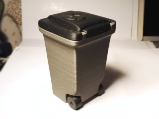
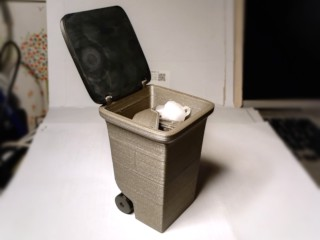
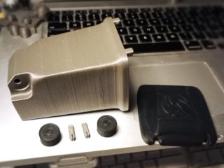

# Mini Trash Can with moving wheels
*3D printable small trash can with all moving parts (formerly thing:1935572)*

### License
[Creative Commons - Attribution - Non-Commercial](https://creativecommons.org/licenses/by-nc/4.0/)

### Attribution
This is a remix of 3D-Fuel's Mini trash can ([Thingiverse thing:1902152](https://www.thingiverse.com/thing:1902152)).

### Gallery

[🔎](images/trashcan1.jpg) [🔎](images/trashcan2.jpg) [🔎](images/trashcan3.jpg)

## Description and Instructions

I like the 3D-Fuel [Mini trash can](http://www.thingiverse.com/thing:1902152), but it lacks something. Moving wheels! I therefore remixed it so now it is exactly like the real thing.
I also slightly increased the inside volume for that little bit of extra trash capacity.

The wheels come in two variants. If you have a hard time making the regular wheels spin, try the ‘widerHole’ ones. Of course reaming the hole will help as well (I have found the inside measuring prongs of a caliper to work well for this, and it allows to immediately see how much wider you have made the hole.)

Another change w.r.t. the original model is that the lid is hollow (again, more like the real thing). This makes it slightly more difficult to print, but the hollow lid is lighter, hence reduces the risk that the bin will topple over with its lid open. It also provides a wee bit of extra room to pile up junk! The solid lid from the [original model](https://www.thingiverse.com/thing:1902152) will of course still fit and may be easier to print, but it can be difficult to remove from your platform due to the enormous contact surface.

I also provide the lid without logo, in case you want to add your own.

## Printing

I printed this in silver and black ABS, the main body in 0.2 mm layers, the rest 0.1.
My print shows some cracks because I was testing some new settings with too aggressive cooling. In general I would not recommend ABS for this model unless you can avoid all its problems.

The lid with built-in supports should be an easy print and might use less material than auto-generated supports. The supports can be removed with pliers, don't pull on them but wiggle them sideways to break them loose. There is also a plain model in case you prefer to use your own slicer's supports.

If you print the lid in a warp-prone filament, it is advisable to use a brim or raft to improve contact surface with the bed, otherwise the corners may lift and it won't be a perfect fit.

If for some reason the lid is too difficult to print, you can always fall back to the [original solid lid](http://www.thingiverse.com/thing:1902152).

If you want to print the bin and lid in different types of filaments with different shrinkage factors (e.g. ABS and PLA), you may have to scale up the part printed in the filament that shrinks the most by a fraction of a percent, otherwise it could be hard or impossible to mount the lid, or it may be too sloppy.

## Post-printing

If you have difficulty mounting the lid, use a knife to remove any material that seems to be in the way. This can be the case especially if your first layer is squashed too much.

## Updates

### 2016/12/03
First upload to Thingiverse.

### 2017/01/19: v2
Increased the wall thickness at the top where it was rather thin. Also created a version of the insert without a bottom, useful if you want to use the trashcan as a holder for pens or other long tools.

### 2017/05/18: v3, lid v2
Made the lid hollow, like the real thing. Also nudged the wheels outwards for slightly better stability.

### 2020/03/30
Migrated to GitHub.

### 2022/07/10: lid v3, added Blender source file
The lid now has a bit of extra clearance to prevent it from scraping against the trash can while opening. Added lids without logo.

### 2025/07/17: v4
Small tweak to the lid shape to make it slightly thicker and easier to print, and made the built-in supports thinner for easier removal. Flattened top rim of trashcan for cleaner print.

## Tags
`3D-Fuel`, `3DFuel`, `Garbage`, `prop`, `recycle`, `Trash`, `trash_can`, `wheelie_bins`, `wheels`